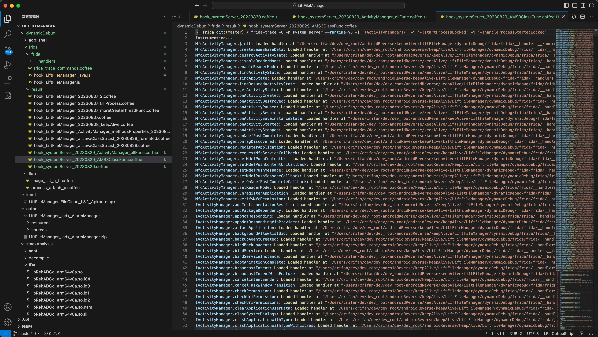
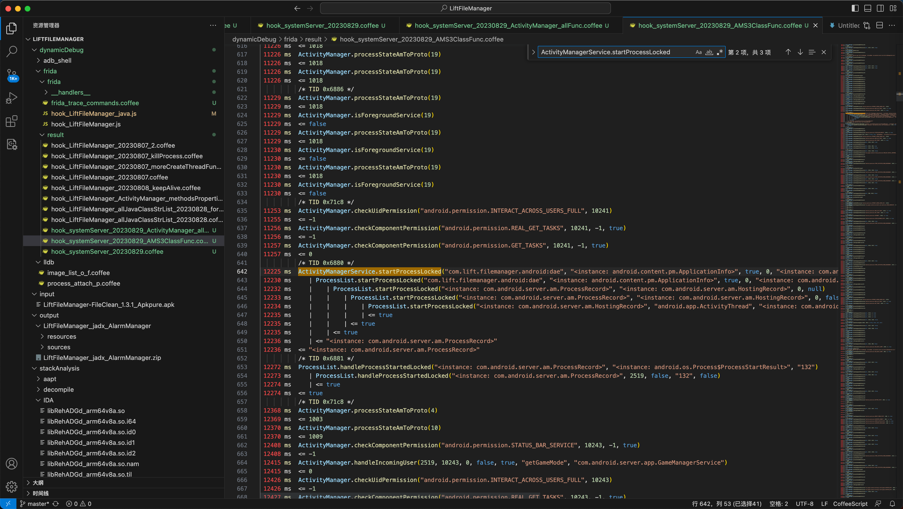
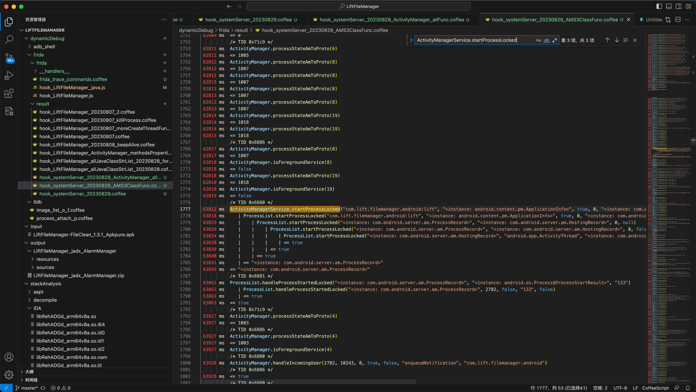

# 安卓系统进程system_server

此处列出frida-trace去hook安卓系统进程system_server的效果：

去hook：
* 类的全部函数
  * ActivityManager
* 类的部分函数
  * ProcessList
  * ActivityManagerService

命令：

```bash
frida-trace -U -n system_server --runtime=v8 -j '*ActivityManager!*' -j '*!startProcessLocked' -j '*!handleProcessStartedLocked'
```

测试和触发：

测试了2次进程被杀和重启

```bash
redfin:/ # ps -A | grep lift
u0_a243      14053 12478 14853776 110652 do_epoll_wait      0 S com.lift.filemanager.android:sist
u0_a243      14380 12478 33445164 159208 do_epoll_wait      0 S com.lift.filemanager.android
u0_a243      16957 12478 14876024 110164 do_epoll_wait      0 S com.lift.filemanager.android:lift
u0_a243      20739 12478 14909548 110300 do_epoll_wait      0 S com.lift.filemanager.android:dae
redfin:/ # kill 16957
redfin:/ # ps -A | grep lift
u0_a243      28151 26549 14881452 110076 do_epoll_wait      0 S com.lift.filemanager.android:sist
u0_a243      28164 26549 14828204 109280 do_epoll_wait      0 S com.lift.filemanager.android:dae
u0_a243      28337 26549 33535192 167804 do_epoll_wait      0 S com.lift.filemanager.android
u0_a243      30398 26549 14895600 112296 do_epoll_wait      0 S com.lift.filemanager.android:lift
redfin:/ # kill 28164
redfin:/ # ps -A | grep lift
u0_a243       2519 26549 14968296 108068 do_epoll_wait      0 S com.lift.filemanager.android:dae
u0_a243      28151 26549 14881452 108304 do_epoll_wait      0 S com.lift.filemanager.android:sist
u0_a243      28337 26549 33482836 166176 do_epoll_wait      0 S com.lift.filemanager.android
u0_a243      30398 26549 14878116 110572 do_epoll_wait      0 S com.lift.filemanager.android:lift
redfin:/ # kill 30398
```

log：

```bash
➜  frida git:(master) ✗ frida-trace -U -n system_server --runtime=v8 -j '*ActivityManager!*' -j '*!startProcessLocked' -j '*!handleProcessStartedLocked'
Instrumenting...
NfcActivityManager.$init: Loaded handler at "/Users/crifan/dev/dev_root/androidReverse/keepAlive/LiftFileManager/dynamicDebug/frida/frida/__handlers__/android.nfc.NfcActivityManager/_init.js"
...
IActivityManager.addInstrumentationResults: Loaded handler at "/Users/crifan/dev/dev_root/androidReverse/keepAlive/LiftFileManager/dynamicDebug/frida/frida/__handlers__/android.app.IActivityManager/addInstrumentationResults.js"
...
ActivityManager.-$$Nest$smgetTaskService: Loaded handler at "/Users/crifan/dev/dev_root/androidReverse/keepAlive/LiftFileManager/dynamicDebug/frida/frida/__handlers__/android.app.ActivityManager/___Nest_smgetTaskService.js"
ActivityManager.$init: Loaded handler at "/Users/crifan/dev/dev_root/androidReverse/keepAlive/LiftFileManager/dynamicDebug/frida/frida/__handlers__/android.app.ActivityManager/_init.js"
ActivityManager.broadcastStickyIntent: Loaded handler at "/Users/crifan/dev/dev_root/androidReverse/keepAlive/LiftFileManager/dynamicDebug/frida/frida/__handlers__/android.app.ActivityManager/broadcastStickyIntent.js"
...
ActivityManagerService.startProcessLocked: Loaded handler at "/Users/crifan/dev/dev_root/androidReverse/keepAlive/LiftFileManager/dynamicDebug/frida/frida/__handlers__/com.android.server.am.ActivityManagerService/startProcessLocked.js"
Started tracing 375 functions. Press Ctrl+C to stop.
           /* TID 0x71c9 */
  1223 ms  ActivityManager.checkUidPermission("android.permission.INTERACT_ACROSS_USERS_FULL", 10241)
  1227 ms  <= -1
...


 11257 ms  ActivityManager.checkComponentPermission("android.permission.GET_TASKS", 10241, -1, true)
 11257 ms  <= 0
           /* TID 0x6880 */
 12225 ms  ActivityManagerService.startProcessLocked("com.lift.filemanager.android:dae", "<instance: android.content.pm.ApplicationInfo>", true, 0, "<instance: com.android.server.am.HostingRecord>", 0, false, false)
 12230 ms     | ProcessList.startProcessLocked("com.lift.filemanager.android:dae", "<instance: android.content.pm.ApplicationInfo>", true, 0, "<instance: com.android.server.am.HostingRecord>", 0, false, false, 0, false, 0, null, null, null, null, null)
 12232 ms     |    | ProcessList.startProcessLocked("<instance: com.android.server.am.ProcessRecord>", "<instance: com.android.server.am.HostingRecord>", 0, null)
 12233 ms     |    |    | ProcessList.startProcessLocked("<instance: com.android.server.am.ProcessRecord>", "<instance: com.android.server.am.HostingRecord>", 0, false, false, null)
 12234 ms     |    |    |    | ProcessList.startProcessLocked("<instance: com.android.server.am.HostingRecord>", "android.app.ActivityThread", "<instance: com.android.server.am.ProcessRecord>", 10243, [3002,3003,50243,20243,9997], 17377280, 0, 1, "default:targetSdkVersion=33:complete", "arm64-v8a", "arm64", null, "371714070", "371714070")
 12235 ms     |    |    |    | <= true
 12235 ms     |    |    | <= true
 12235 ms     |    | <= true
 12236 ms     | <= "<instance: com.android.server.am.ProcessRecord>"
 12236 ms  <= "<instance: com.android.server.am.ProcessRecord>"
           /* TID 0x6881 */
 12272 ms  ProcessList.handleProcessStartedLocked("<instance: com.android.server.am.ProcessRecord>", "<instance: android.os.Process$ProcessStartResult>", "132")
 12273 ms     | ProcessList.handleProcessStartedLocked("<instance: com.android.server.am.ProcessRecord>", 2519, false, "132", false)
 12274 ms     | <= true
 12274 ms  <= true
           /* TID 0x71c8 */
 12368 ms  ActivityManager.processStateAmToProto(4)

...


 62818 ms  ActivityManager.isForegroundService(8)
 62818 ms  <= false
 62818 ms  ActivityManager.processStateAmToProto(19)
 62818 ms  <= 1018
 62818 ms  ActivityManager.isForegroundService(19)
 62819 ms  <= false
           /* TID 0x6880 */
 63812 ms  ActivityManagerService.startProcessLocked("com.lift.filemanager.android:lift", "<instance: android.content.pm.ApplicationInfo>", true, 0, "<instance: com.android.server.am.HostingRecord>", 0, false, false)
 63818 ms     | ProcessList.startProcessLocked("com.lift.filemanager.android:lift", "<instance: android.content.pm.ApplicationInfo>", true, 0, "<instance: com.android.server.am.HostingRecord>", 0, false, false, 0, false, 0, null, null, null, null, null)
 63823 ms     |    | ProcessList.startProcessLocked("<instance: com.android.server.am.ProcessRecord>", "<instance: com.android.server.am.HostingRecord>", 0, null)
 63826 ms     |    |    | ProcessList.startProcessLocked("<instance: com.android.server.am.ProcessRecord>", "<instance: com.android.server.am.HostingRecord>", 0, false, false, null)
 63834 ms     |    |    |    | ProcessList.startProcessLocked("<instance: com.android.server.am.HostingRecord>", "android.app.ActivityThread", "<instance: com.android.server.am.ProcessRecord>", 10243, [3002,3003,50243,20243,9997], 17377280, 0, 1, "default:targetSdkVersion=33:complete", "arm64-v8a", "arm64", null, "371765665", "371765665")
 63838 ms     |    |    |    | <= true
 63839 ms     |    |    | <= true
 63840 ms     |    | <= true
 63841 ms     | <= "<instance: com.android.server.am.ProcessRecord>"
 63843 ms  <= "<instance: com.android.server.am.ProcessRecord>"
           /* TID 0x6881 */
 63861 ms  ProcessList.handleProcessStartedLocked("<instance: com.android.server.am.ProcessRecord>", "<instance: android.os.Process$ProcessStartResult>", "133")
 63862 ms     | ProcessList.handleProcessStartedLocked("<instance: com.android.server.am.ProcessRecord>", 2782, false, "133", false)
 63863 ms     | <= true
 63863 ms  <= true
           /* TID 0x71c9 */
 63927 ms  ActivityManager.processStateAmToProto(4)
...
```

截图：






