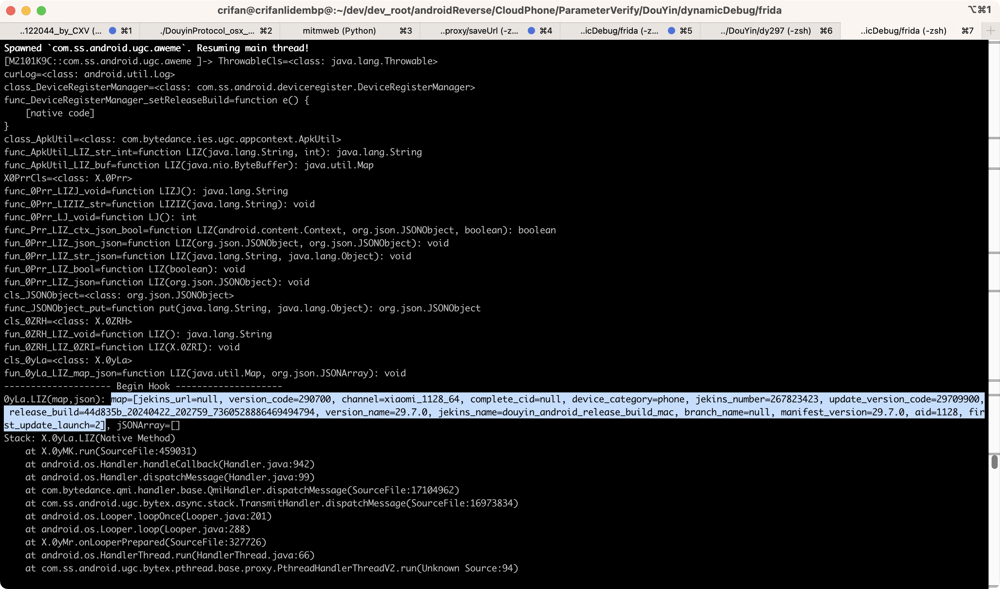

# Java类型转换

## `mapToStr` + `mapToKeyValueStrList`

### 代码

```js
// convert (Java) map (java.util.HashMap) key=value string list
function mapToKeyValueStrList(curMap){
  var keyValStrList = []
  var HashMapNode = Java.use('java.util.HashMap$Node')
  // console.log("HashMapNode=" + HashMapNode)
  var iterator = curMap.entrySet().iterator();
  // console.log("iterator=" + iterator)
  while (iterator.hasNext()) {
    var entry = Java.cast(iterator.next(), HashMapNode)
    // console.log("entry=" + entry)
    var curKey = entry.getKey()
    var curVal = entry.getValue()
    // console.log("key=" + entry.getKey() + ", value=" + entry.getValue());
    var keyValStr = `${curKey}=${curVal}`
    // console.log("keyValStr=" + keyValStr);
    keyValStrList.push(keyValStr)
  }
  // console.log("keyValStrList=" + keyValStrList)
  return keyValStrList
}


// convert (Java) map (java.util.HashMap) to string
//  curMap="<instance: java.util.Map, $className: java.util.HashMap>"
function mapToStr(curMap){
  // return JSON.stringify(curMap, (key, value) => (value instanceof Map ? [...value] : value));
  var keyValStrList = mapToKeyValueStrList(curMap)
  // console.log("keyValStrList=" + keyValStrList)
  var mapStr = keyValStrList.join(", ")
  var mapStr = `[${mapStr}]`
  // console.log("mapStr=" + mapStr)
  return mapStr
}
```

### 举例

调用：

```js
mapToStr(someMap)
```

输出：


```bash
map=[jekins_url=null, version_code=290700, channel=xiaomi_1128_64, complete_cid=null, device_category=phone, jekins_number=267823423, update_version_code=29709900, release_build=44d835b_20240422_202759_7360528886469494794, version_name=29.7.0, jekins_name=douyin_android_release_build_mac, branch_name=null, manifest_version=29.7.0, aid=1128, first_update_launch=2]
```



